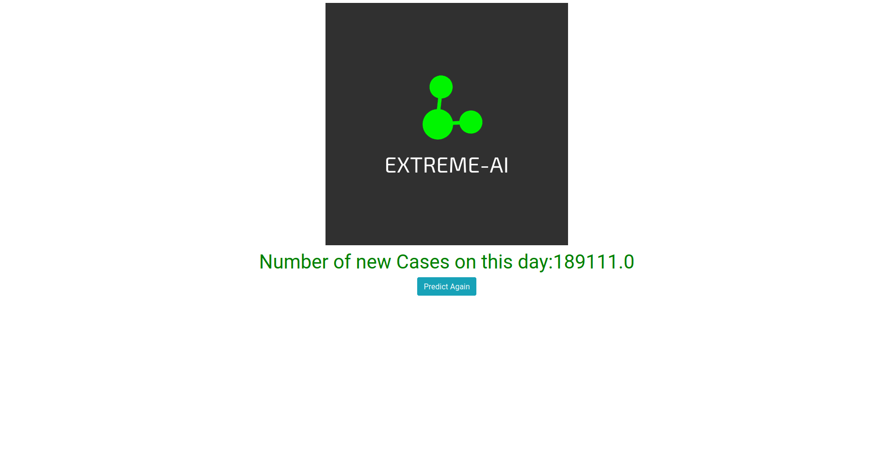

# Corona Predictor

Click <a href="https://extreme-corona-predictor.herokuapp.com/">here</a> to view the site

A basic model to predict number of new cases/deaths/recovered per day.

# Tools/Languages Used
  
  * Django framework(Python based) is used as a backend
  * Website is hosted on heroku
  
# Images

  
# Prerequisites
  * Django for backend
  * Heroku for deployment
  * Basic CSS/HTML for frontend
  * Python
  * AI(beginner)
  
# Getting Started

   1.Fork it!

   2.Clone the forked repository to local system.
   
   3.Read issues and solve it, or add your own issues 😊

   4.Commit your changes: git commit -m 'Add some feature'.

   5.Push to the <a href="">feature</a> branch

   7.Submit a pull request 😄

### If you had fun, consider to give a star ⭐ to this repository
  
  

  

